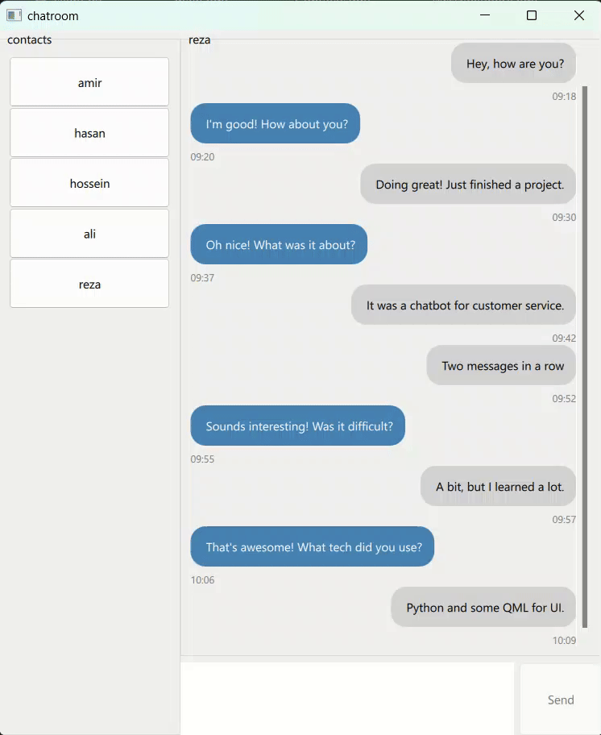

# pyside6-chat
A lightweight chat app built with PySide6 and QML.



### how to run
1. Clone the repository:
```
git clone https://github.com/AmirHossienAfshar/pyside6-chat.git
```
2. Install dependencies:
```
pip install -r requirements.txt
```
3. Run the program:
```
python main.py
```